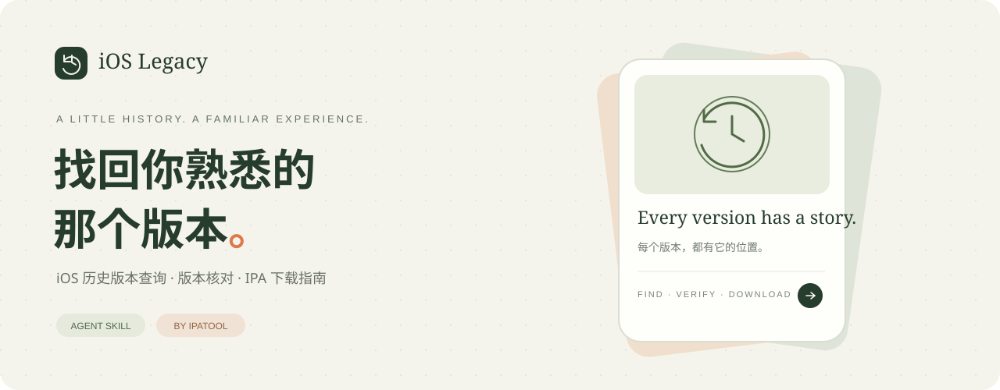

<p align="center"><a href="README.md">简体中文</a> · <a href="README.en.md"><strong>English</strong></a></p>

<p align="center">
  
</p>

<h1 align="center">iOS Legacy App Download</h1>

<p align="center"><strong>Ask your Agent to find and download a legacy iOS app version.</strong></p>
<p align="center">An Agent Skill and practical guide built around ipatool.<br>Once the Skill and ipatool are configured and you have signed in locally, describe the app and version you want to a compatible Agent.<br>The workflow connects app lookup, version identification, and IPA download.</p>

<p align="center">
  
  
  
  
</p>

<p align="center">
  <a href="#quick-start">Quick start</a> ·
  <a href="#use-as-an-agent-skill">Install the Skill</a> ·
  <a href="skills/ios-legacy-app-download/references/workflow.md">Full guide (in Chinese)</a> ·
  <a href="#frequently-asked-questions">FAQ</a> ·
  <a href="#disclaimer">Disclaimer</a> ·
  <a href="docs/index.html">Landing page source (Chinese with an English overview)</a>
</p>

---

## Why this project exists

You may remember an app's old interface, a feature from before an update, or a version that worked better on an older device, without knowing where to begin looking.

This project brings app identity, version numbers, version IDs, and download steps into one workflow. Follow the documentation yourself, or ask an Agent that supports `SKILL.md` to help with lookup and download after the initial setup and local sign-in.

**This repository provides a Skill and an operational guide. The underlying download capability comes from upstream [ipatool](https://github.com/majd/ipatool).** Whether a particular version can be retrieved depends on Apple services, your account's app license, and whether that version is still available for download.

## What it helps you do

| Your starting point or goal | How the project helps |
| :--- | :--- |
| You only know the app name | Look up the App ID, Bundle ID, and target storefront |
| You know the target version number | Retrieve historical version IDs, query metadata, and verify the matching version |
| You remember roughly when the app was updated | Use the update history shown on the App Store to narrow the search |
| You want to keep an older app package | Use your own Apple account to download a specific IPA version that remains available to you |
| You want an Agent to handle the workflow | Provide a clear Skill workflow, credential boundaries, and guidance for handling failures |

## A clear path to an IPA

<p align="center"></p>

1. **Identify the app.** Check its name, App ID, Bundle ID, and storefront to avoid confusing apps with similar names.
2. **Locate the version.** Retrieve available version IDs, then verify their corresponding version numbers. Dates are supporting clues.
3. **Download and check.** Save the IPA locally, inspect the app information inside it, and retain your verification results.

## Quick start

You need an Apple account with App Store access and the upstream Go version of ipatool. On Windows or Linux, choose the archive for your platform and architecture from the [official releases](https://github.com/majd/ipatool/releases). On macOS, you can also use `brew install ipatool`.

The commands below assume `ipatool` is on your `PATH`. On Windows, if you extracted the executable into the current directory, replace `ipatool` with `./ipatool.exe`.

### 1 · Sign in to your own account

Run this in your own interactive terminal, then enter your password and two-factor authentication code when prompted:

```sh
ipatool auth login --email "your-apple-account@example.com"
```

Enter passwords, verification codes, and keychain passphrases locally. **Do not send them to chats, Issues, or commit history.** If the keychain needs to be unlocked, follow the prompts in your local terminal.

### 2 · Find the app and available versions

```sh
ipatool search "App name" --limit 5
ipatool list-versions --app-id APP_ID
ipatool get-version-metadata --app-id APP_ID --external-version-id VERSION_ID
```

Replace `App name` with your search term, and replace `APP_ID` and `VERSION_ID` with values from the results. `VERSION_ID` is Apple's historical version identifier, **not** a displayed version number such as `2.10.11`. Use the returned `displayVersion` to verify that you have found the version you want.

### 3 · Download the selected version

```sh
ipatool download --app-id APP_ID --external-version-id VERSION_ID --output "./app-legacy.ipa"
```

First confirm that your account has a license for the app. After the file downloads, check the Bundle ID, version number, and minimum OS requirement in `Payload/*.app/Info.plist` inside the IPA. See the [full usage guide (in Chinese)](skills/ios-legacy-app-download/references/workflow.md) for detailed steps.

> These examples were checked against upstream v2.6.0 command source on 2026-10-03. Downloads were not tested with a real Apple account. Before using them, check your local `ipatool --version` and the relevant command's `--help` output.

## Use as an Agent Skill

Download or clone this repository, then copy the **entire** `skills/ios-legacy-app-download` folder into a skill directory supported by your Agent. Preserve the relative locations of `references/` and `agents/`. Follow your Agent's documentation for its specific loading mechanism.

```text
ios-legacy-app-download/
├── SKILL.md
├── agents/openai.yaml
└── references/
    ├── workflow.md
    └── legacy-api.md
```

First install ipatool and complete account sign-in in your own terminal. Once the Skill is loaded, you can start with a request such as:

```text
Use $ios-legacy-app-download to help me download version [VERSION] of [APP NAME] from the [REGION] storefront and save the IPA locally.
```

If you do not know the exact version, give the Agent a little more context:

```text
Use $ios-legacy-app-download to help me find a historical version of an iOS app.
App name: …
Storefront region: …
Target version number or approximate update date: …
Verify the available versions first. If account sign-in is needed, let me complete it in my local terminal.
```

The Skill does not include an account or bundle ipatool. Installing it does not automatically sign you in or start a download. The Skill and detailed reference documents are currently in Chinese.

## Understand the limits before using it

- **Historical versions may no longer be available.** A version listed in an app's update history may already be unavailable for download.
- **Downloading an IPA does not mean you can install it.** Downloaded packages commonly have FairPlay encryption. Signing, device OS, account licensing, and app architecture can all affect installation and execution. Ordinary re-signing does not automatically remove encryption.
- **Cross-check update dates.** App Store pages show only part of the historical record, and their structure can change. Dates returned by an API should not automatically be treated as the actual release date of each version.
- **Your account interacts with Apple services.** This repository has no server that collects your account details. The upstream tool communicates with Apple and stores local session data according to its own implementation. Session files must also be kept private.
- **Treat download and installation as separate steps.** Do not delete the version currently on your device before confirming your installation method and backing up your data.

## Disclaimer

- **Independent project and authorization.** This project is not officially affiliated with or endorsed by Apple, app developers, or ipatool maintainers. Use your own account, operate within the authorization you hold, and comply with applicable laws, Apple service terms, and app licenses. Having an app license does not automatically authorize third-party tool or API access to a service.
- **Respect third-party rights.** Apps, trademarks, and content belong to their respective rights holders. Do not use this project to bypass payment or access restrictions, circumvent DRM, or copy, distribute, or sell app packages without authorization. “Research” or “personal use” does not automatically waive authorization requirements.
- **No guaranteed results; assess the risks.** The project and documentation are provided as is. They do not guarantee that a historical version can be found, downloaded, installed, or run. Third-party tools may involve account authentication checks, session exposure, installation failures, data loss, or compatibility issues. Protect credentials and back up data before taking action.
- **Liability is subject to applicable law.** To the extent permitted by applicable law, the project makes no guarantee of availability, compatibility, or fitness for a particular purpose. This statement does not exclude or limit liability that cannot legally be excluded or limited, or affect rights you have under applicable law.

Read the [full disclaimer (in Chinese)](DISCLAIMER.md) and the [Apple Media Services Terms and Conditions](https://www.apple.com/legal/internet-services/itunes/) that apply to your account's region.

## Frequently asked questions

<details>
<summary><strong>Is this a one-click download app?</strong></summary>

This is an Agent Skill and guide repository, with a static landing page. It uses ipatool for lookup and download and does not include a desktop client or hosted download service. A compatible Agent can help carry out the workflow after setup and local account sign-in.

</details>

<details>
<summary><strong>Can it download every historical version of every app?</strong></summary>

There is no such guarantee. App licenses, storefront regions, account status, and the versions Apple still makes available can all affect the result. Finding a version ID does not guarantee that the version can be downloaded successfully.

</details>

<details>
<summary><strong>Why does the version ID look different from the app's version number?</strong></summary>

`externalVersionID` is the numeric ID Apple uses to identify a particular version release. `displayVersion` is the version number users normally see. Verify the metadata with `get-version-metadata`; do not pass a displayed version number directly to the download command as a version ID.

</details>

<details>
<summary><strong>Do I still need the manual API workflow from older documentation?</strong></summary>

Check the current ipatool `list-versions` and `get-version-metadata` commands first. The original manual API workflow is preserved as a [legacy workflow reference (in Chinese)](skills/ios-legacy-app-download/references/legacy-api.md) for troubleshooting and compatibility research. Its continued availability is not guaranteed.

</details>

<details>
<summary><strong>What if sign-in fails or my account has no license for the app?</strong></summary>

Check your upstream tool version, account region, two-factor authentication status, and whether your local terminal supports interactive input. Identify the cause before taking further action; do not repeatedly retry account authentication automatically. For licensing issues, check that the app appears in your account's purchase history. Do not let an Agent purchase an app or acquire a license without your confirmation.

</details>

## Repository structure

```text
.
├── README.md                         Project overview in Simplified Chinese
├── README.en.md                      Project overview in English
├── docs/                             Static landing page and visual assets
├── skills/ios-legacy-app-download/    Self-contained, copyable Skill
├── .github/ISSUE_TEMPLATE/            Bug report and feature request templates
├── CONTRIBUTING.md                   Contribution guide
├── SECURITY.md                       Credential and session handling
├── DISCLAIMER.md                     Full disclaimer
└── PUBLISHING.md                      Repository and GitHub Pages publishing guide
```

The Skill, detailed guides, and policy documents are currently in Chinese. The landing page is Chinese with an English overview.

## Contributing and licensing

Contributions that document reproducible issues, update upstream command guidance, or improve the workflow across platforms are welcome. Read the [contribution guide (in Chinese)](CONTRIBUTING.md) before submitting. Remove account details, Cookies, DSIDs, verification codes, and personal local paths from logs and screenshots.

This repository has not yet adopted an open-source license. Contact the maintainer to confirm permission before reusing or redistributing its contents. Upstream ipatool's license is managed in its own repository.

## Acknowledgments and sources

- [majd/ipatool](https://github.com/majd/ipatool): app lookup, authentication, and IPA download capabilities.
- [ipatool v2.6.0](https://github.com/majd/ipatool/releases/tag/v2.6.0): the version used to check the commands in this guide.
- [Historical version lookup source](https://github.com/majd/ipatool/blob/v2.6.0/cmd/list_versions.go) and [version metadata source](https://github.com/majd/ipatool/blob/v2.6.0/cmd/get_version_metadata.go): references for parameters and result fields.
- [Apple iTunes Lookup API documentation](https://developer.apple.com/library/archive/documentation/AudioVideo/Conceptual/iTuneSearchAPI/LookupExamples.html): public app information lookup.

This project is independent of Apple and upstream ipatool. App names, trademarks, and content belong to their respective rights holders.
